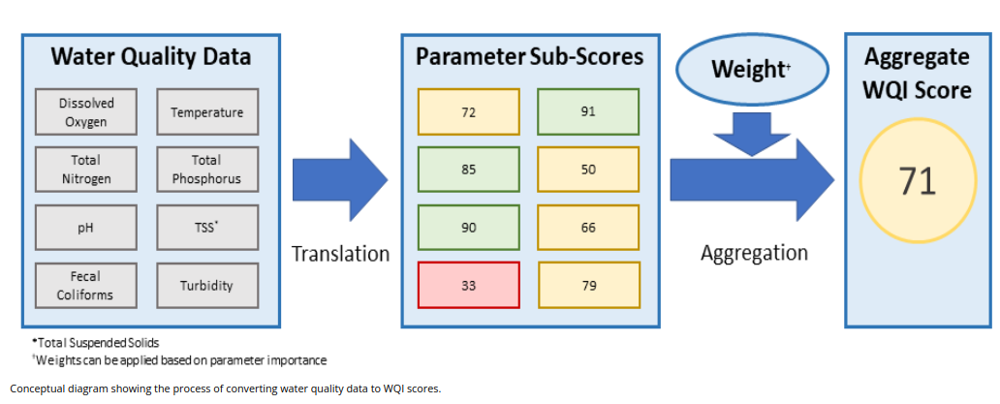

```{r setup, include=FALSE}
# for not outputting echo
knitr::opts_chunk$set(echo = FALSE, results='hide', message=FALSE, warning=FALSE)
# for python 
library(reticulate)
```

<!-- sets the style for the headers -->
```{r test, child="styles.Rmd", eval=TRUE}
```

```{python, results="markup"}
import myutils as ut
import pandas as pd
import seaborn as sns
import matplotlib.pyplot as plt
import numpy as np
#print(ut.PATH_DATA)

# set rows and columns to show all of it
pd.set_option('display.max_columns', None)
pd.set_option('display.max_rows', None)

# setup for seaborn plots
sns.set_style('darkgrid')
sns.set_palette('Set2')

# there was a warning about mixed types in column=3 so I set the low_memory to False
df_org = pd.read_csv(ut.PATH_DATA_ORG, low_memory=False)
df = pd.read_csv(ut.PATH_DATA, low_memory = False)

```


# Ask: Business Task Statement

- How does WQI change over the years? Select a few stations with long recording
logs and answer the question, whether the water quality was better in the past, 
or is better now, or is worse?

- How does WQI change depending on the geographical location? Select a few
stations at different geographical locations and compare WQI. Is there any pattern
such as more densely populated areas have WQI worse than sparsely populated areas?
Does any of the areas such as north/south/east/west have cleaner water over 
the others?

# Prepare: Data Source

The source of data is [@wqi_streams_source]. The data is published by 
King County Washington State.

## Data Organization
```{python}
file_name = ut.PATH_DATA_ORG.split("/")[-1]
```

Data is contained in a single csv file named: `r py$file_name`.

## Data Credibility

The data is provided by the government entity and I assume they follow the 
standards for collecting and publishing credible data.

## Data Bias

The presence of bias in the data is a challenging question to address. However, given that the data source is a governmental agency, it is reasonable to expect that they have taken measures to minimize any potential bias.

## License and Attribution 

Public Domain [@wqi_streams_source].

# Process: Data Wrangling

I added one column 'Month.new' where 'WholeYear' was replaced with 13 in 
LibreOffice Calc, so months
are represented as numbers 1-12 and the whole year is represented as the number 13.
I removed the column 'Month' and renamed 'Month.new' to 'Month'.

```{python}
df.drop(["Month"], axis = 1, inplace = True)
df.rename(columns = {"Month.new" : "Month" }, inplace = True)

# number of rows in the data frame
#row_count = len(df.index)
# number of columns in the data frame
# col_count = len(df.columns)
row_count, col_count = df.shape
```

The number of rows is `r py$row_count` organized in `r py$col_count` 
columns but the column "GeoLocation" has no values so it will be removed.

```{python, results="markup"}
# a concise summary of your data frame
df.info()
```

## Incorrect Data Types

Automatically assigned data types are reasonable so there was no need for 
any correction.

## Missing Data

```{python}
# you can also check df.info()
ut.find_missing(df)

# a concise summary of your data frame
missing_data = df.isnull()
wqi = missing_data["WQI"].value_counts().to_dict()
geo = missing_data["GeoLocation"].value_counts().to_dict()

wqi_perc = round(ut.percentage(wqi[True], wqi[True] + wqi[False]), 1)
geo_perc = round(ut.percentage(geo[True], geo[True]), 1)

```

### GeoLocation
It seems that WQI has missing `r py$wqi['True']`, i.e., `r py$wqi_perc`% values 
and GeoLocation `r py$geo['True']`, i.e., `r py$geo_perc`%.

I removed the GeoLocation column as it has no values. 

```{python}
# it does not 
# column GeoLocation does not have anything, so byebye
df.drop(["GeoLocation"], axis = 1, inplace = True)
```

### WQI NaN
This study is about WQI, so having rows that have missing WQI values is 
pointless. They might be useful for analysis which stations have missing WQI
readings. I removed rows with missing WQI values.

```{python}
# keep rows that have not NAN in WQI
df = df[df['WQI'].notna()]
```

## Descriptive Statistics

```{python}
# reset index, because we dropped columns
df.reset_index(drop=True, inplace=True)
row_count, col_count = df.shape
```

The number of rows is `r py$row_count` organized in `r py$col_count` 
columns. 
```{python, results="markup"}
df.info()
df.describe(include = "all")
```

### Categorical and Numerical

|No. | Categorical Variables | Numerical Variables |
| --: |:---------------------- |:--------------------|
|1. | Locator | WaterYear |
|2. | Month   | WQI
|3. | ParameterGroup | lng |
|4. | MostRecentSample | lat |
|5. | SiteName| |
|6. | StreamName| |

Categorical data has from 13 to 78 unique values depending on the category. The 
minimum number of characters is 3 and the maximum name consists of 49 characters.

```{python, results="Markup"}
# getting info about unique values and length of 
categ = ['Locator', 'ParameterGroup', 'SiteName', 'StreamName']

for c in categ:
  l = df[c].unique().tolist()
  # get the max and min length of the categories
  print('Cat.: ', c, ' unique values count=', len(l), 
  ' min=', len(min(l, key = len)), ' max=', len(max(l, key = len)))
  # if you want to see the unique values
  #print('l=', l)
```

```{python}
# show the boxplots for categorical variables and WQI
# uncomment if you want to see it
#for c in categ:
#  p = sns.boxplot(x=c, y='WQI', data=df)
#  plt.setp(p.get_xticklabels(), rotation=45)
#  plt.xlabel(c)
#  plt.show()
```

### Data Ranges

WQI seems the most problematic as some values are out of range.

#### Water Quality Index (WQI)

```{python}
# examining the value of WQI
df_high_wqi = df[df['WQI'] > 100]
# count the observation with WQI > 100
high_wqi_count = len(df_high_wqi)
#df_high_wqi

wqi_180up_count = len(df_high_wqi[df['WQI'] > 180])
```

There is a problem with values for the WQI. According to [@wqi_green2] and other
sources the WQI values are ranging from from 10 to 100, where the higher
the number, the higher the water quality. There are `r py$high_wqi_count` WQI 
values $\gt 100$ in this dataset, shown in Figure below. `r py$wqi_180up_count` 
out of `r py$high_wqi_count` WQI values are $> 180$.

```{python high_wqi}
# to see a pandas boxplot
#df_high_wqi.boxplot(column=['WQI'])
#plt.title("WQI descriptive stats")
#plt.show()

#sns.boxplot(x='WQI', data=df_high_wqi, orient='v')
sns.boxplot(data=df_high_wqi[["WQI"]], orient="v")
#sns.boxplot(data=df_high_wqi, x='WQI', orient="v")
plt.xlabel('Entire WQI column')
plt.ylabel('WQI')
plt.title("Descriptive stats about WQI > 100.")
plt.show()

# uncomment if you want to see boxplots per Stream
#sns.boxplot(y = "WQI", x="StreamName", data=df_high_wqi, orient="v")
#plt.title("Descriptive stats about WQI > 100 per stream.")
#plt.show()

#bins = np.linspace(min(df_high_wqi["WQI"]), max(df_high_wqi["WQI"]), 4)
#group_names = ["low " + str(max(df_high_)), "med", "high"]
#df_high_wqi["WQI_binned"] = pd.cut(df_high_wqi["WQI"], bins, labels=group_names, include_lowest = True)
plt.hist(df_high_wqi["WQI"])
plt.title("Histogram WQI > 100")
plt.show()
```

I have tried to contact the data owner with no luck and given that the
number of observations with WQI $> 100$ is low compared to the number of all 
observations I decided to remove all observations violating  the condition 
WQI $> 100$.

```{python}
# for further analysis, I will drop all rows with WQI > 100
df2 = df[df['WQI'] <= 100.0]
```

WQI stratification according to [@wqi_green2] is as follows:

- scores 80+, *low concern* because did not fail water quality standards or guidelines
- scores 40 to 80, *modern concern*
- scores below 40, *high concern*


```{python}
# binning WQI according to suggestions in report
criteria = [df2['WQI'] < 40, 
            (df2['WQI'] < 80) & (df2['WQI'] >= 40),
			       df2['WQI'] >= 80]
assign_vals = [1,2,3]
df2['WQI_binned'] = np.select(criteria, assign_vals).astype("int")
df2.head()
```
I decided to bin observations according to WQI scores as specified in [@wqi_green2]
and added the column *WQI_binned* with values:

- 1 indicating *high concern*, WQI $<$ 40,
- 2 indicating *modern concern*, 40 $\le$ WQI $<$ 80,
- 3 indicating *low concern*, WQI $\ge$ 80.

#### Locator
It seems that it is an identifier for a measuring station.
```{python, results="Markup"}
df2['Locator'].unique().tolist()
```

#### ParameterGroup

As explained in [@wqi_background]

> "The Water Quality Index (WQI) is a general method used to report water quality data for many parameters as a single number or score. Using a WQI helps to compare water quality for different sampling locations over time. WQIs have been widely used in many fields of water quality, from drinking water to watershed management, since the 1800s. Horton (1965) developed the first parameter based numerical WQI in 1965 to evaluate the health of rivers. Horton’s method integrated ten commonly monitored water quality parameters. 
> 

> WQI methods follow three steps. First, water quality data is collected. Next, concentrations or measurements of parameters are converted to subindex scores on a common scale. Scoring metrics are typically based on water quality standards and technical guidelines. Finally, scores are aggregated into a single number."



The further explanation on the website [@wqi_background]:

> "Washington Department of Ecology (Ecology) adapted an index developed by the Environmental Protection Agency (EPA) Region 10. Ecology adjusted the scoring metrics to reflect local water quality standards and/or guidelines. They also modified the nutrient scoring metrics to better reflect conditions in Puget Sound lowland streams."

> "King County is using Ecology’s Puget Sound lowland stream version of the WQI. The WQI developed by Ecology ranges from 0-100: the higher the number, the higher the water quality. It includes eight parameters: temperature, dissolved oxygen, pH, fecal coliform bacteria, total nitrogen, total phosphorus, total suspended sediment, and turbidity (Hallock, 2002). The scoring metrics for parameters are based on regulatory standards. Those levels are defined by criteria in Washington’s Water Quality Standards, WAC 173-201A. Nutrient and sediment measures have no set standard. Therefore, results for those metrics are expressed relative to guidelines for this ecoregion. Results from the eight parameters are aggregated over time to produce a single score for each monitoring site. In general, stations scoring 80 and above did not fail water quality standards or guidelines and are of "low concern". Scores 40 to 80 indicate “moderate concern”, and water quality at stations with scores below 40 are of "high concern."  "


It seems that that the idea behind the column 'ParameterGroup' is to measure
several parameters on a monthly basis with 'MonthlyScore' and once per year
'AnnualScore' per Locator. I understand that 'AnnualScore' is calculated based
on monthly scores (maybe as a mean) and 'MonthlyScore' is weighted sum of
monthly parameters.

```{python, results="Markup"}

df2[['Locator', 'WaterYear', 'WQI', 'Month', 'ParameterGroup']].sort_values(['Locator', 'WaterYear', 'Month'], ascending = [True, True, True]).head(15)

#param_grp = df2['ParameterGroup'].unique().tolist()

# uncomment to see all ParameterGroup values
#for c in param_grp:
#  print("------------ ParameterGroup value = ", c)
#  param_df = df2[df2['ParameterGroup'] == c]
#  param_df.head()

#print("This is example for ParameterGroup=", param_grp[3])
#df2[df2['ParameterGroup'] == param_grp[3]].head()
```

#### Relations Among Locator, lng, lat, and SiteName, and StreamName

```{python}
# get only unique rows
loc_df = df2[['Locator','lng', 'lat', 'SiteName', 'StreamName']].drop_duplicates()
```


##### StreamName and SiteName {-}

The StreamName can be assigned to many SiteName. 

```{python, results="Markup"}
stream_name = 'Green'
stream_df = loc_df[loc_df['StreamName'] == stream_name]
stream = stream_df.sort_values('StreamName')
print(stream)
stream_count = len(stream)
```

For instance, the stream named `r py$stream_name` has `r py$stream_count` corresponding
sites.


##### Uniqueness of Locator, lat, lng, and SiteName {-}

It seems that 'Locator' is an identifier for the 'SiteName' that has unique
'lat' and 'lng'.

```{python, results="Markup"}
print("Are there any duplicates, given Locator, lng, lat, and SiteName?", 
loc_df[['Locator', 'lng', 'lat', 'SiteName']].duplicated().any()
)
print("Are there duplicates in lng and lat? ", loc_df[['lng', 'lat']].duplicated().any())
print("Are there duplicates in Locator? ", loc_df[['Locator']].duplicated().any())
print("Are there duplicates in  SiteName? ", loc_df[['SiteName']].duplicated().any())
```

# Final Version

```{python}
# Get the lengths and number of columns
df_org_len = len(df_org)
df2_len = len(df2)
diff_count = df_org_len - df2_len

df_org_col = len(df_org.columns)
df2_col = len(df2.columns)
diff_col = df_org_col - df2_col
```

At this point I consider the data is clean enough and can be used for the next
stage, i.e., analysis. I have removed some rows with missing WQI values. 
I have removed one column 'GeoLocation' and added 
a new column 'WQI_binned' to represent strata of WQI according to Washington
recommendations. 

|     | Current Dataset | Original Dataset | Original - Current (Diff) |
| :--: | --------------: | ----------------:| -------------------------:|
| Rows count | `r py$df2_len` |  `r py$df_org_len` | `r py$diff_count` |
| Cols count | `r py$df2_col` |  `r py$df_org_col` | `r py$diff_col` |


The data structure is as follows:

```{python, results="markup"}
# a concise summary of your data frame
df2.info()
```


```{python, results="Markup"}
# at this point I consider the data is clean enough and I dump it to the file

import os.path

# get the name of the directory path without the name of the file
head, tail = os.path.split (ut.PATH_DATA_PROCESSED)

try:
    os.makedirs(head, exist_ok = True)
    # Directory head,  created successfully or existed )
    if os.path.isfile(ut.PATH_DATA_PROCESSED):
      print("WARNING: File exists in location: ", ut.PATH_DATA_PROCESSED, " No write ...")
    else:
      df2.to_csv(ut.PATH_DATA_PROCESSED, index = False)
      print("INFO: File written to ", ut.PATH_DATA_PROCESSED)
    
except OSError as error:
    print("ERROR: Directory ", head, 
    " cannot be created ... File NOT written ...", ut.PATH_DATA_PROCESSED)
```


# Notes

- There are many WQI values missing and some are $> 100$. This might be worth to
investigate. WQI values $> 100$ might be because a single WQI value is 
calculated from several parameters and values of those parameters and/or 
weights might not be normalized.


# References
